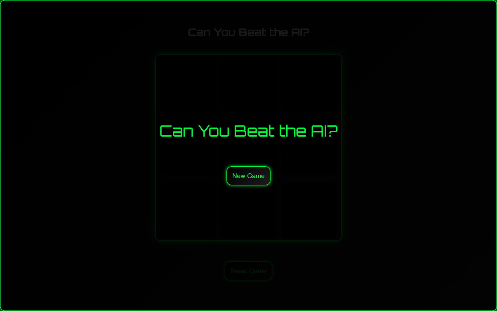
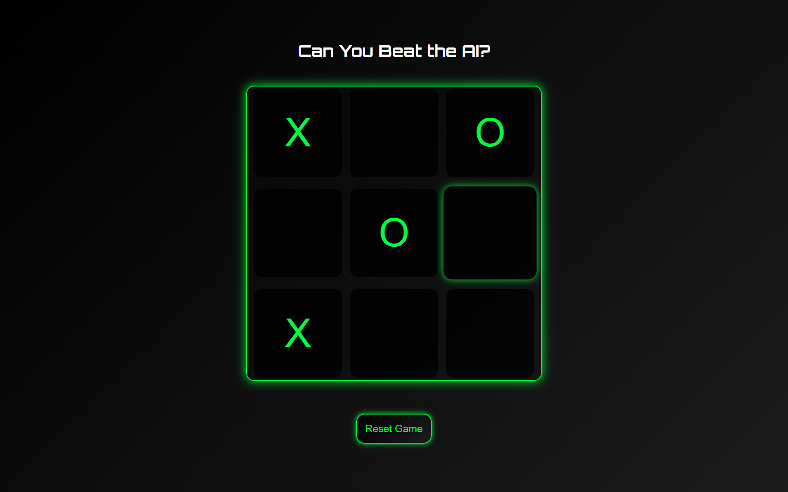

# AI-Powered Tic-Tac-Toe Game

Welcome to the AI-Powered Tic-Tac-Toe game! This classic game is implemented using HTML, CSS, and JavaScript, featuring an intelligent AI opponent that uses the Minimax algorithm for decision-making.

## Live Demo

Experience the game live: [Play Tic-Tac-Toe]()

## Screenshots

Here are some screenshots of the Tic-Tac-Toe Game:

### Home Page



### Game Space



## Features

- **AI Opponent**: Play against a challenging AI that uses the Minimax algorithm.
- **Responsive Design**: Enjoy smooth gameplay on various devices and screen sizes.
- **Real-Time Interaction**: Experience immediate responses from the AI.
- **Choice of Move**: Decide whether you want to make the first move or let the AI start.
- **Win Detection**: Automatic detection and display of game outcomes (win, lose, or draw).

## Technologies Used

- **HTML5**: Structures the game board and UI elements.
- **CSS3**: Styles the game for an appealing and responsive design.
- **JavaScript (ES6+)**: Implements game logic, AI algorithm, and interactive features.

## How to Play

1. Open the game in your web browser.
2. Choose an option:
   - "Start AI" to let the AI make the first move
   - "Start You" to make the first move yourself
3. If you chose "Start You", click on an empty cell to make your move. If you chose "Start AI", wait for the AI to make its move.
4. Take turns with the AI, clicking on empty cells to place your symbol.
5. The game continues until one player wins by getting three of their symbols in a row (horizontally, vertically, or diagonally), or until the board is full, resulting in a draw.
6. Once the game ends, you can restart to play again!

## Installation

To run the game locally:

### Prerequisites

- A modern web browser (Chrome, Firefox, Safari, or Edge recommended)
- Git (optional, for cloning)

### Steps

1. **Get the Code**:

   - Option 1: Clone the repository
     ```
     git clone
     ```
   - Option 2: Download the ZIP file and extract it

2. **Navigate to the Project Directory**:
   ```
     cd TIC-TAE-TOE
   ```
3. **Launch the Game**:

- Double-click on `index.html`, or
- Open `index.html` with your preferred web browser

## Project Structure

- `index.html`: Main game structure and layout
- `css/styles.css`: Styling and responsive design
- `js/script.js`: Game logic and AI implementation

## The Minimax Algorithm

The AI opponent utilizes the Minimax algorithm, a recursive decision-making algorithm used in two-player games. Here's how it works:

1. **Recursive Exploration**: The algorithm explores all possible future moves and their outcomes.
2. **Scoring**: Each possible end game state is assigned a score (+10 for AI win, -10 for player win, 0 for draw).
3. **Backtracking**: The algorithm works backwards from end states to determine the best move.
4. **Optimal Decision**: The AI chooses the move that leads to the best possible outcome, assuming the player also plays optimally.

This implementation ensures that the AI is always making the best possible move, making it a formidable opponent.

## Contributing

Contributions are welcome! If you'd like to improve the game:

1. Fork the repository
2. Create your feature branch (`git checkout -b feature/AmazingFeature`)
3. Commit your changes (`git commit -m 'Add some AmazingFeature'`)
4. Push to the branch (`git push origin feature/AmazingFeature`)
5. Open a Pull Request

## Developer

- **Name**: Saurav Das
- **Email**: saurav.das@iitg.ac.in

## Acknowledgements

- Inspiration for the Minimax algorithm implementation from various online resources.
- Thanks to the open-source community for providing valuable learning materials on game development and AI algorithms.
- Gratitude to all beta testers who provided feedback during the development process.

---

Enjoy playing Tic-Tac-Toe against the AI! If you encounter any issues or have suggestions for improvements, please open an issue on the GitHub repository. Happy gaming!
